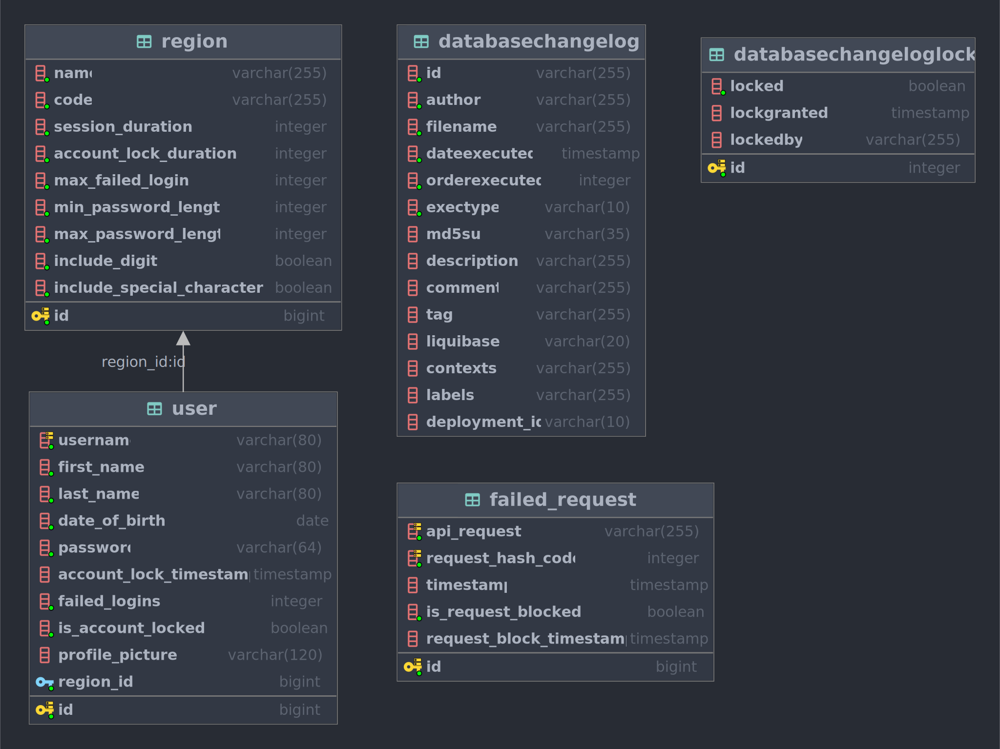

# My Health Pass Auth Library

[](https://github.com/Kerron-Hutton/my-health-pass-auth-library/actions/workflows/maven_lint_and_test.yml)

[](https://opensource.org/licenses/MIT)


Standalone package that is used by the MyHealthPass team at ZS. This package was created  
to secure the backend solution that manages health records. **Registration**, **Authentication**  
and **Authorization** are just a few core functionality that this package implements.

## Configuring IntelliJ IDE

In order to ensure that the code quality match our organization
standards, **[Checkstyle](https://checkstyle.sourceforge.io/index.html)** was used to   
automate the checking of our code base. For ease of development it is recommended that each   
developer configure IntelliJ to integrate with our custom checkstyle configuration.

1. Install the IntelliJ IDEA **[Checkstyle Plugin](https://plugins.jetbrains.com/plugin/1065-checkstyle-idea)**
    - File → Settings → Plugins
    - Restart IDE

2. Update IDEA's Code Style to obey the Checkstyle Rules
    - File → Settings → Editor → Code Style
    - Click the small gear icon next to `Scheme`, Select `Import Scheme` → CheckStyle Configuration
    - Select our checkstyle.xml
    - Click OK
    - Click Apply

3. Configure auto wrap lines at right margin
    - File → Settings → Editor → Code Style → Java → Wrapping and Braces
    - CHECK `Ensure right margin is not exceeded`
    - Click OK

## Integration Testing

To facilitate integration testing the java library **Testcontainers** was used. additional information can be found  
on **[Getting started with Testcontainers](https://www.testcontainers.org/quickstart/junit_5_quickstart/)**.

***Note:*** You must have docker running!! No additional configurations are required.

## Installing Package

In order to install our library the below configurations should be added to your `~/.m2/settings.xml` file.  
Replace `GITHUB_USERNAME` and `GITHUB_TOKEN` with your GitHub information. Additional information can  
be found
on **[Working with the Apache Maven registry](https://docs.github.com/en/packages/working-with-a-github-packages-registry/working-with-the-apache-maven-registry)**
.

***Note:*** Your `GITHUB_TOKEN` must have at least the `packages:read` scope assigned to it.

```xml
<?xml version="1.0" encoding="UTF-8"?>
<settings xsi:schemaLocation="http://maven.apache.org/SETTINGS/1.2.0 http://maven.apache.org/xsd/settings-1.2.0.xsd"
          xmlns="http://maven.apache.org/SETTINGS/1.2.0"
          xmlns:xsi="http://www.w3.org/2001/XMLSchema-instance">
    <servers>
        <server>
            <id>github</id>
            <username>GITHUB_USERNAME</username>
            <password>GITHUB_TOKEN</password>
        </server>
    </servers>

    <activeProfiles>
        <activeProfile>github</activeProfile>
    </activeProfiles>

    <profiles>
        <profile>
            <id>github</id>
            <repositories>
                <repository>
                    <id>central</id>
                    <url>https://repo1.maven.org/maven2</url>
                </repository>
                <repository>
                    <id>github</id>
                    <url>https://maven.pkg.github.com/Kerron-Hutton/my-health-pass-auth-library</url>
                    <snapshots>
                        <enabled>true</enabled>
                    </snapshots>
                </repository>
            </repositories>
        </profile>
    </profiles>
</settings>

```

## Library Usage

In pom.xml, add the following xml stanza between `<dependencies> ... </dependencies>`

```xml

<dependency>
    <groupId>com.zs.library</groupId>
    <artifactId>my-health-pass-auth</artifactId>
    <version>2.0.0</version>
</dependency>
```

Specify the below required environment variable:

```properties
# If the max request failure is reached within in this time (minutes) the
# api request will be blocked until lockout duration is met.
request.signature_failure.threshold=0
# Duration in minutes that api request will be blocked for.
request.signature_lock.duration=0
# The maximum amount of time that an api request can fail.
request.signature_max.failure=0
# File server directory that profile pictures will be stored in.
file.server.directory=""
# The secret must be between 32 and 64 character and include at least 
# one number, digit, special, uppercase and lower case characters.
authentication.jwt.secret=""
```

Example use in a spring boot application

```java
public class MyHealthPass {

  @Autowired
  private IdentityManagement identity;

  @Autowired
  private UserRepository repository;

  @Bean
  CommandLineRunner runner() {
    return args -> {
      ApiRequestSignature apiSignature = ApiRequestSignature.builder()
          .userAgent("Mozilla/5.0 (Windows NT 6.1; Win64; x64; rv:47.0) Gecko/20100101 Firefox/47.0")
          .cookies(Map.of("SID", "234032QE21_"))
          .clientIp("207.207.130.108")
          .build();

      UserAccountDetailsDto accountDetailsDto = UserAccountDetailsDto.builder()
          .dateOfBirth(LocalDate.parse("2010-09-03"))
          .regionCode(RegionCode.CAN)
          .username("john.brown876")
          .firstName("John")
          .lastName("Brown")
          .build();

      String password = "joHn100%";

      Long registerUserId = identity.register(
          accountDetailsDto, password
      );

      Optional<UserEntity> registeredUser = repository.findById(registerUserId);

      Optional<String> userAuthToken = identity.login(
          accountDetailsDto.getUsername(), password, apiSignature
      );

      UserIdentityDto userIdentity = identity.authenticate(userAuthToken.get());

      System.out.println(registeredUser.get());

      System.out.println(userIdentity);

    };
  }
}
```

## Database Schema



## Additional Document

The `My Health Pass Auth Library` documentation UI can be found in the following directory:

```
├── documentation
│   ├── apidocs
│   │   ├── index.html
```
